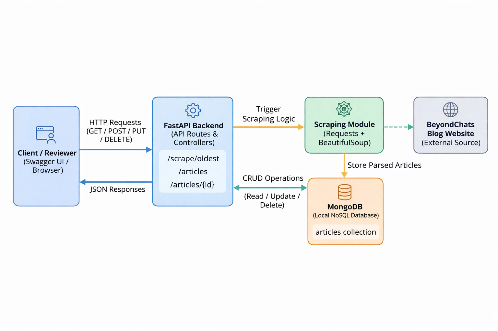

# BeyondChats Blog Scraper API


This project is a backend service built using **FastAPI** and **MongoDB** to scrape blog articles from the BeyondChats website and expose them via REST APIs.
The project is being developed **phase-wise**, focusing first on solid backend foundations before adding scraping and advanced logic.

---

## Project Overview

This project is a **backend service** that scrapes the **5 oldest blog articles** from the BeyondChats blog, stores them in **MongoDB**, and exposes them through **RESTful APIs built with FastAPI**.

The goal is to demonstrate how an external content source can be:

1. Programmatically extracted
2. Persisted in a database
3. Managed using standard CRUD operations
---
# Phase 1: Content Ingestion Pipeline (Scraping + CRUD APIs)

### What is implemented

* Identification of the **last page** of the BeyondChats blog using pagination analysis
* Scraping of the **oldest articles** (title, URL, author, published date, content)
* Storage of articles in MongoDB with **duplicate checks**
* REST APIs to:

  * Create articles
  * Fetch all articles
  * Fetch an article by ID
  * Update an article
  * Delete an article
* Input validation and error handling for invalid IDs and missing records
* Auto-generated API documentation using Swagger (`/docs`)


---


## Tech Stack

### Backend

* **Python 3**
* **FastAPI** – REST API framework for building performant and well-documented APIs
* **Uvicorn** – ASGI server for running the FastAPI application
* **Requests** – HTTP client for fetching blog pages
* **BeautifulSoup (bs4)** – HTML parsing and data extraction
* **Pydantic** – Data validation and schema definition

### Database

* **MongoDB (Local instance)** – NoSQL database used to store scraped and user-managed articles
* **PyMongo** – MongoDB driver for Python

### Frontend

* **To be added**
  (Planned lightweight frontend to display original and updated articles, as required by the assignment. The backend APIs are frontend-ready.)

### Tools & Utilities

* **Git** – Version control
* **Swagger UI** – API testing and validation
* **dotenv** – Environment variable management


---

## Features Checklist

* ✅ **Oldest Article Scraping**

  * Automatically identifies the last blog page
  * Scrapes the **5 oldest articles** (bottom-to-top traversal)
  * Handles pagination when the last page has fewer than 5 articles

* ✅ **MongoDB Persistence**

  * Stores scraped articles in MongoDB
  * Prevents duplicate entries using URL-based checks

* ✅ **CRUD REST APIs**

  * Create new articles
  * Fetch all articles
  * Fetch article by ID
  * Update article by ID
  * Delete article by ID

* ✅ **ID-based Operations**

  * Proper MongoDB `ObjectId` validation
  * Graceful handling of invalid or non-existent IDs

* ✅ **Error Handling**

  * Invalid request formats
  * Missing resources (404)
  * Safe failure during scraping without crashing the server

* **Frontend Integration**

  * Backend APIs are fully ready for frontend consumption
  * Frontend planned to display original and updated articles as per assignment requirement

Here’s a **clean, recruiter-friendly “Project Directory Structure” section** based exactly on your screenshot.
You can **copy-paste this directly** into `README.md`.

---

## Project Directory Structure

```
WebScrap/
│
├── app/
│   ├── main.py          # FastAPI application entry point & API routes
│   ├── scraper.py       # Web scraping logic for fetching oldest blog articles
│   ├── database.py      # MongoDB connection and database initialization
│   ├── models.py        # Pydantic models for request/response validation
│   ├── __init__.py      # Marks app as a Python package
│   └── __pycache__/     # Python cache files (auto-generated)
│
├── requirements.txt     # Project dependencies
├── README.md            # Project documentation
├── .env                 # Environment variables (MongoDB URI, local only)
├── myEnv/               # Local Python virtual environment
└── .vscode/             # Editor configuration (optional)
```


---


## Architecture / Data Flow Diagram


### Architecture Overview

This project follows a simple and modular backend architecture designed for clarity and maintainability.

The FastAPI backend acts as the central layer, exposing REST APIs used by reviewers through Swagger UI. When the scraping endpoint is triggered, the backend invokes a dedicated scraping module built using Requests and BeautifulSoup, which fetches blog pages from the BeyondChats website and extracts article data.

The processed articles are stored in a MongoDB NoSQL database, allowing flexible storage and easy updates. All CRUD operations (create, read, update, delete) are handled through API endpoints, enabling articles to be retrieved, modified, or removed without re-scraping.

This architecture cleanly separates concerns between API handling, scraping logic, and data persistence, making the system easy to evaluate, extend, and maintain.

---
## API Endpoints Summary

| Method | Endpoint                 | Description                                             |
| ------ | ------------------------ | ------------------------------------------------------- |
| GET    | `/articles`              | Fetch all stored articles                               |
| GET    | `/articles/{article_id}` | Fetch a single article by its ID                        |
| POST   | `/articles`              | Create a new article manually                           |
| PUT    | `/articles/{article_id}` | Update an existing article by ID                        |
| DELETE | `/articles/{article_id}` | Delete an article by ID                                 |
| POST   | `/scrape/oldest`         | Scrape and store the 5 oldest BeyondChats blog articles |

---

### Notes :

* All endpoints are documented and testable via **Swagger UI (`/docs`)**
* IDs use MongoDB `ObjectId` format
---


## Local Setup Instructions

### Prerequisites

Ensure the following are installed on your system:

* **Python 3.9+**
* **MongoDB (Local instance running on default port `27017`)**
* **Git**

---

### 1. Clone the Repository

```bash
git clone https://github.com/PRATIK-P145/API_scraping.git
cd API_scraping
```

---

### 2. Create and Activate Virtual Environment

```bash
python -m venv myEnv
```

**Windows**

```bash
myEnv\Scripts\activate
```

**macOS / Linux**

```bash
source myEnv/bin/activate
```

---

### 3. Install Dependencies

```bash
pip install -r requirements.txt
```

This installs FastAPI, MongoDB client, scraping libraries, and supporting tools.

---

## 4. Configure Database (MongoDB)

### **i. Check MongoDB Installation**

Open a new PowerShell/CMD window:

```bash
mongod --version
```

If not installed:
 [https://www.mongodb.com/try/download/community](https://www.mongodb.com/try/download/community)

---

### **ii. Start MongoDB Server**

```bash
mongod
```

Keeps running on the default port **27017**.

---

### **iii. Connect with MongoDB Compass**

Use the URI:

```
mongodb://localhost:27017
```


Ensure MongoDB is running locally before proceeding.

---

### 5. Start the FastAPI Server

```bash
uvicorn app.main:app --reload
```

If successful, the server will start at:

```
http://127.0.0.1:8000
```

---

### 6. Verify API Availability

Open Swagger UI in the browser:

```
http://127.0.0.1:8000/docs
```

All available APIs and request schemas can be tested from this interface.

---

### 7. Run the Scraper (Phase 1 Requirement)

Trigger the scraping process using Swagger UI or via `curl`:

```bash
POST /scrape/oldest
```

This will:

* Identify the last page of the BeyondChats blog
* Scrape the **5 oldest articles**
* Store them in MongoDB
* Skip duplicates if already present

---

### 8. Verify Stored Data

Use the following endpoint to confirm data persistence:

```bash
GET /articles
```

You should see the scraped articles returned from MongoDB.

---

### 9. Test CRUD Operations

From Swagger UI:

* Fetch article by ID
* Update article content
* Delete article
* Observe proper error handling for invalid or missing IDs

---


